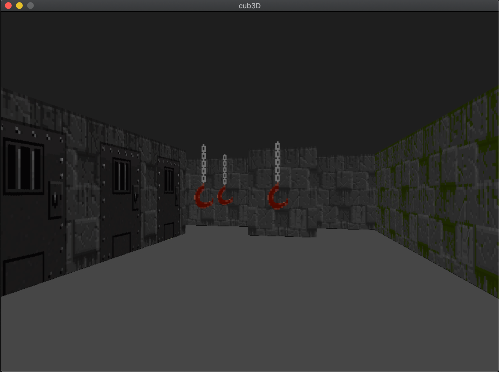

## Objetive

Create a 3D game using RayCast techniques.

## Use

The game uses Makefile and lib `Minilibx`. 
`make` to compile. 
`make start` compile and init the game with the key tutorial printed on terminal.

You can modify `map.cub` to get diferent wall textures, sprite or wall.

I'm working on it, for the moment im going like this:

