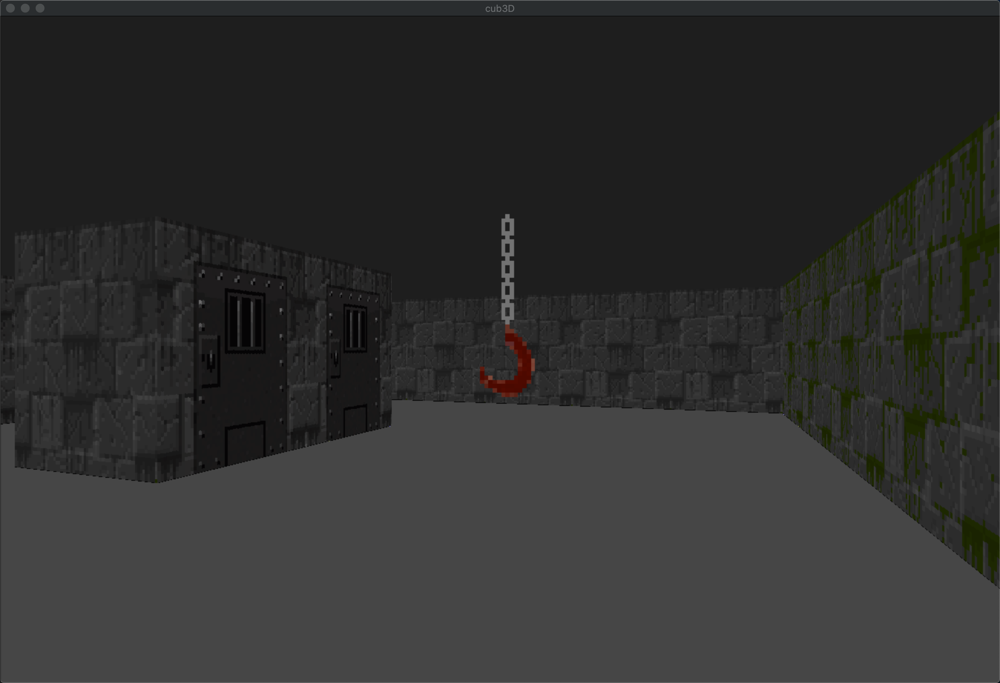

  

## Objetive

Create a 3D game using RayCast techniques.

## Use

The game uses Makefile and `Minilibx` library. 
`make` to compile. 
`make start` compile and initialize the game with the key tutorial printed on terminal.

You can modify `map.cub` to get diferent wall textures, sprite or map.

